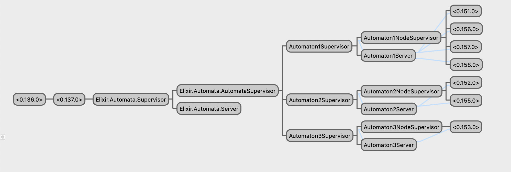
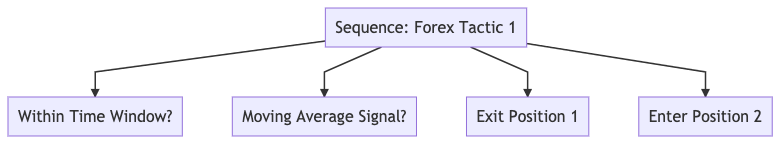

# Automata

### An AI control architecture framework for building autonomous decentralized systems ([ADS](https://en.wikipedia.org/wiki/Autonomous_decentralized_system)).

Spawn a collection of concurrent, distributed, fault tolerant, and highly available intelligent agents for coordinated and/or uncoordinated action in one or many environments with no central point of failure.


## Implementation Overview

### Technology
 [Elixir](https://elixir-lang.org/) & [OTP](https://en.wikipedia.org/wiki/Open_Telecom_Platform) provide the primitives for robust fault-tolerant, highly available self-healing concurrent distributed systems.

 [Behavior trees](https://en.wikipedia.org/wiki/Behavior_tree_(artificial_intelligence,_robotics_and_control)) are increasingly used in place of finite state machines (FSM's) and other AI control architectures due to improved properties of modularity, flexibility, reusability, and efficiency of implementation. To keep modules lean and keep the trees focused on actions, one potential approach is to utilize an external decision making system (finite state machine, decision tree, utility, stochastic, etc..) for all decision making, keeping nodes focused on actions.


##### Work in Progress - not ready for production systems. We need Contributors, please reach out to [ericsteen1@gmail.com](mailto:ericsteen1@gmail.com) if interested!

Currently `Automata` has a single-node (machine) architecture, with the goal to implement multi-node (full fault tolerance) in the future.

### Requirements

#### A system is defined as an Autonomous decentralized system if the following 2 properties are satisfied:

 1. Autonomous Controllability: Even if any subsystem fails, is repaired, and/or is newly added, the other subsystems can continue to manage themselves and function.

 2. Autonomous Coordinability: Even if any subsystem fails, is repaired, and/or is newly added, the other subsystems can coordinate their individual objectives among themselves and can function in a coordinated fashion.

    - With `Automata`, while it is a property of the behavior tree implementation that user-defined nodes are independent, it is left to the designer to ensure coordination independence among all nodes in order to satisfy this property.

## Features

### Functional Features:
- #### User defined behavior tree control and execution nodes
  - Selector
  - Sequence
  - Parallel
  - Priority
  - Condition nodes
  - In-node Decorators

- #### A Concurrent, Scalable Blackboard System using ETS.
  - A global blackboard that can broadcast messages without being a central point of failure.
  - Potentially bringing the code to the data rather than the other way around.


### Performance Features:
- Concurrency
  - News flash! The world is concurrent. For example: we see, hear, and move at the same time. Elixir concurrency is a first class citizen of it's design and makes it dead simple.
- High availability
  - Elixir is renowned for being capable of 99.9999999% uptime with relatively little work.
- Fault Tolerance
  - Supervision Trees provide strong guarantees for error recovery and self healing systems.
- Scalability
  -  Elixir can handle millions of processes (134 million +/-) without breaking a sweat on a single machine, and easily distributes work onto multiple machines with it's builtin distribution mechanisms.
  - Behavior trees provide value stream scalability (design/development and operations/testing).
- Modularity
  - Procedural programming is dead. Modular BT's allow the designer to hierarchically combine independently developed, tested, (and eventually deployed) and reusable smaller behaviors that provide more complex and interesting (and valuable) emergent behaviors in the large.
- Flexibility
  - A design goal of `Automata` is to allow high flexibility (supports many use cases)
- Simplicity of Implementation
  - Elixir's meta-programming capabilities facilitate very user-friendly API's so developers don't need to know the details of BT's or Automata Theory to get things done.

### Applications
- Trading Systems
- Swarm Intelligence / Distributed Robotics
- Intelligent agents with soft realtime multi-dimensional sensory, perception and intuition capabilities
- Blockchain Smart Contract Systems
- Analytics Systems (Intel, Split Testing, etc...)
- Smart Home/IOT Systems
- High-Speed Rail Systems (Japan has an ADS railway)
- Chatbots & Game AI's
- QA Testing (BT's are particularly suited to combinatorial testing)
- ? (choose your adventure)


## Contributing

### Welcome to the Automata project!

##### I am eager for your contributions and so happy you found yourself here! Here are our current needs:

- Artificial Intelligence/Cognitive Architecture/BT Expertise
- Elixir Design/Architecture Expertise
- ETS Expertise for BlackBoard System
- Test Coverage
- Documentation

### How it works

#### High Level Overview

##### The Automata supervision tree


There are 3 Layers in the "core" supervision tree below the Application supervisor.

The terminal nodes of the "core" are the `AutomatonNodeSupervisor` who's job it is to supervise the user-defined behavior tree nodes with the help of its "brain" – the `AutomatonServer`. The `AutomatonServer` currently handles the bulk of the logic of the system, as it is responsible for parsing user-config, and starting and managing the user-defined nodes. It starts the user defined nodes as children of `AutomatonNodeSupervisor`, which is kept lean for fault tolerance purposes.

The following is a breakdown of roles and responsibilities in the system (corresponding to files in `lib/automata/core/`):

- `Automata.Supervisor`
  - on application start, this supervisor process starts the `AutomataSupervisor` and it's corresponding `Server`. It is started with strategy `:one_for_one` to ensure that the `AutomatonSupervisor` is independently self-healing
- `Automata.Server`
  - acts as the "brains" of the `AutomataSupervisor` to keep the supervisor lean and mean. It starts the `Automata.AutomatonSupervisor`, passing the user-defined config.
- `Automata.AutomatonSupervisor`
  - this process acts as supervisor to each `AutomatonNodeSupervisor` and has strategy `:one_for_all` to ensure that errors restart the entire supervision tree including the GenServers (`AutomatonServer`). It delegates the spawning of the user-defined BT nodes to the `AutomatonServer` which currently handles most of the logic.
- `AutomatonNodeSupervisor`
  - runs concurrently, independently, and with `restart: permanent`. This supervisor is the root of the user-defined behavior trees.
- `AutomatonServer`
  - this is the most complicated node as it parses and validates the user configuration and creates and manages the user-defined behavior tree nodes.
- `Automaton`
    - the user defined node (runs as placeholder, with it's replacement being developed in `core/control/behavior.ex`)


##### The Blackboard

- Global Blackboard
  - all nodes share this data store
  - a collection of automata will act upon seeing any data change in the global blackboard.
- Individual Node Blackboards
  - node blackboards have protected tables for data sharing – all processes can read, one process has write access


### API
```elixir
defmodule MyNode do
  use Automata,

    # required
    # one of :sequence, :selector, :parallel, etc...
    # or type :execution for execution nodes (no children)
    node_type: :selector,

    # the frequency of updates for this node(tree), in seconds
    tick_freq: 0.001, # 1ms

    # not included for execution nodes
    # list of child control/execution nodes
    # these run in order for type :selector and :sequence nodes
    # and in parallel for type :parallel
    children: [ChildNode1, ChildNode2, ChildNode3]
end
```

### Example

Below is a simplified hypothetical example of a sequence node(subtree) for an autonomous "Forex Trader". The first two leafs are condition nodes, and the last two are action nodes.



TODO: how to implement the above scenario.

#### Where to read about BT's and the underlying technologies:
- [CraftAI BT Grammar Basics](https://www.craft.ai/blog/bt-101-behavior-trees-grammar-basics/)

- [Behavior Tree Starter Kit](http://www.gameaipro.com/GameAIPro/GameAIPro_Chapter06_The_Behavior_Tree_Starter_Kit.pdf) and corresponding [provided source code](https://github.com/aigamedev/btsk) and in particular [this file](https://github.com/aigamedev/btsk/blob/master/BehaviorTree.cpp) which is a basic inspiration for user-defined nodes.

- [Elixir Behavior Tree](https://github.com/jschomay/elixir-behavior-tree) and the corresponding [elixirconf talk](https://elixirforum.com/t/39-elixirconf-us-2018-behavior-trees-and-battleship-tapping-into-the-power-of-advanced-data-structures-jeff-schomay/16785)

- [BT AI](https://github.com/libgdx/gdx-ai/wiki/Behavior-Trees)

- [BlackBoard Architectures](https://books.google.com/books?id=1OJ8EhvuPXAC&pg=PA459&lpg=PA459&dq=blackboard+game+ai&source=bl&ots=iVYGrf_Rzy&sig=ACfU3U31OOqst7Dd7z7fhiH9HoVwBjyVJQ&hl=en&sa=X&ved=2ahUKEwjvxqyR3LHnAhVMrp4KHSSfD4sQ6AEwDHoECAsQAQ#v=onepage&q=blackboard%20game%20ai&f=false)

- [Blackboard Systems](http://gbbopen.org/papers/ai-expert.pdf)

- [BT's in erlang](http://www.brainific.com/blog/2010/05/behaviour-trees-in-erlang-flavour/)


##### Where to ask for help: ericsteen1@gmail.com


## Installation

If [available in Hex](https://hex.pm/docs/publish), the package can be installed
by adding `Automata` to your list of dependencies in `mix.exs`:

```elixir
def deps do
  [
    {:automata, "~> 0.1.0"}
  ]
end
```

## Authors

* **Eric Steen** - [upstarter](https://github.com/upstarter)

See also the list of [contributors](https://github.com/upstarter/automata/contributors) who participated in this project.

## License

This project is licensed under the MIT License - see the [LICENSE.md](LICENSE.md) file for details
